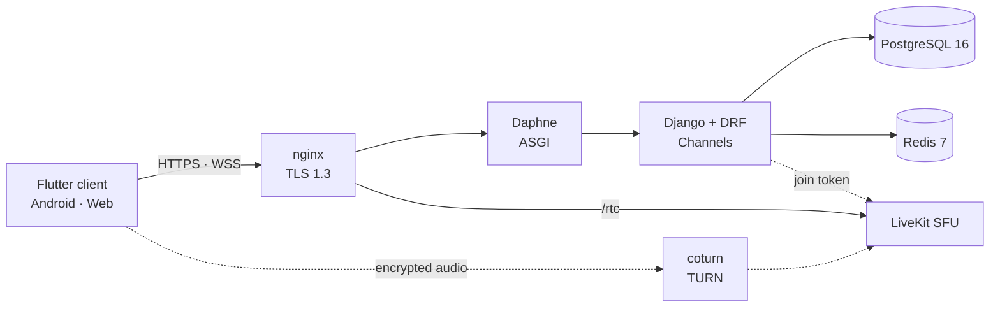

# Communication Platform

A private, self-hosted messaging platform with end-to-end encrypted direct messages,
group chats, and persistent audio-only voice rooms, built to survive a national internet
shutdown.

> **Status: work in progress.** The backend is substantially built; the frontend is an
> application shell only, with no feature screens and no service integrations. Nothing
> here has had an external security audit. This is not recommended for anyone whose
> safety depends on it.

## Why it exists

When a state cuts international connectivity, mainstream messengers stop working: their
servers, push infrastructure, CDNs, and STUN/TURN relays all sit outside the country, so
people lose private communication exactly when they most need it. Every design decision
here follows from removing that dependency — at runtime the system contacts no CDN, no
FCM or APNs, no public STUN/TURN, no external CA, and no third-party API. The only
deployment is a private, invite-only instance serving a small circle from a single VPS;
it is not a public service and is not open for signup.

## What it does

- Direct messages between two users.
- Group chats of up to roughly 50 members.
- Standalone, persistent, audio-only voice rooms.

## Security model

Content — messages, attachments, group state, and voice audio — is encrypted on the
client. The server is a blind relay: it stores and routes opaque, padded ciphertext and
public keys, and it enforces nothing security-relevant. Cross-signing material and
device-list records pass through as blobs it never parses or verifies; every check that
matters happens client-side, against keys the server has never held. No
content-encryption key ever reaches the server, though it does hold infrastructure
secrets — the TLS private key, the JWT signing key, and the LiveKit API secret. Group
chats are pairwise: a message is encrypted once per member device, and the server
keeps no roster, group object, or group key.

The honest limit: an adversary holding live root on the box can watch which authenticated
connection deposits into and collects from each device's queue, which is enough to
reconstruct who talks to whom and when. The social graph and the timing of communication
are not protected against that adversary, and a single-box architecture cannot protect
them.

Full threat model, key inventory, and residual risk:
[backend/SECURITY.md](backend/SECURITY.md).

## Architecture

| Layer | Technology |
|---|---|
| Client | Flutter 3.44.7, Dart 3.12.2 — Android and Web targets only |
| Server | Python 3.12, Django 6.0, Django REST Framework, Channels 4 on Daphne |
| Database | PostgreSQL 16, loopback only |
| Cache and channel layer | Redis 7, loopback only |
| Voice | Self-hosted LiveKit SFU, self-hosted coturn |
| Edge | nginx, TLS 1.3 under a pre-distributed private CA |

## Repository layout

| Path | Owner | Contents |
|---|---|---|
| [`backend/`](backend/) | [Nima Shadloo](https://github.com/n-shadloo) | Django server and system architecture: the `accounts`, `devices`, `vault`, `messaging`, `attachments`, `voicerooms`, `realtime`, `core`, and `config` apps, plus `ops/` deployment artefacts for a single VPS |
| [`frontend/`](frontend/) | [realSeyed](https://github.com/realSeyed) | Flutter client for Android and Web, including all client-side cryptography |

`backend/vendor/wheels` is the offline wheel cache, and it is not tracked in git. The
no-foreign-dependency constraint means the server must install and rebuild with no
internet access, so the operator builds the cache on the VPS with
[`backend/ops/vendor.sh`](backend/ops/vendor.sh) while the network is still available;
[`backend/ops/offline_install.sh`](backend/ops/offline_install.sh) then installs from it
with `--no-index` and `--require-hashes`.

## Documentation

| Document | Covers |
|---|---|
| [backend/README.md](backend/README.md) | Protocol and transport, authentication, the WebSocket gateway, voice, attachments, padding buckets, retention, the full environment-variable table, and local development |
| [backend/SECURITY.md](backend/SECURITY.md) | Threat model, the precise key invariant, what a seizure yields, and residual risk |
| [backend/CLIENT_CONTRACT.md](backend/CLIENT_CONTRACT.md) | The client-side half of every security property; authoritative for client implementations |
| Per-app API reference | [accounts](backend/accounts/API.md) · [devices](backend/devices/API.md) · [vault](backend/vault/API.md) · [messaging](backend/messaging/API.md) · [attachments](backend/attachments/API.md) · [voicerooms](backend/voicerooms/API.md) · [realtime](backend/realtime/API.md) · [core](backend/core/API.md) |
| [docs/architecture/DESIGN-RECORD.md](docs/architecture/DESIGN-RECORD.md) | The system of record for the architecture: the positions table, the assumption ledger, the deferral list, and the decision log |
| [docs/architecture/GROUND-TRUTH.md](docs/architecture/GROUND-TRUTH.md) | The measured facts of the deployment: topology, configuration deviations, scale facts, and the domain rules the code must hold |
| [docs/architecture/decisions/](docs/architecture/decisions/) | One ADR for each architecture decision |
| [frontend/docs/README.md](frontend/docs/README.md) | Index of the client engineering contract: threat model, cryptographic protocol, UI specification, sync engine, and platform notes |

## Current status

Built, with tests: the nine backend apps above — account and device registration,
device-scoped JWT authentication, cross-signing and classical + ML-KEM prekey
distribution, the durable envelope queue, bucketed attachments, voice-room token minting,
and the `/ws` gateway — together with the `ops/` artefacts for deploying them to one VPS.

Not built: the frontend beyond its foundation. It currently has a design system, an
adaptive application shell, environment provisioning with a fail-closed bootstrap, and a
local storage layer; it has no chat, group, voice, or cryptography features. There has
been no external security audit, and the API surface is still moving —
[backend/CLIENT_CONTRACT.md](backend/CLIENT_CONTRACT.md) is authoritative when it changes.

## License

Apache License 2.0 — see [LICENSE](LICENSE). Copyright 2026 Nima Shadloo.

Third-party components keep their own terms: the Python packages pinned in
`backend/requirements/` stay under their respective licenses, and
`frontend/assets/fonts/vazirmatn/` bundles the Vazirmatn font under SIL OFL 1.1.
