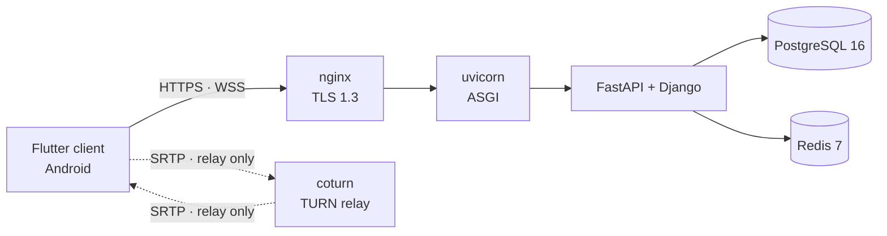

# Communication Platform

A private, self-hosted messaging platform with end-to-end encrypted direct messages and
group chats, built to survive a national internet shutdown. Audio-only voice is designed,
and the server half of it is served.

> **Status: work in progress.** The backend is substantially built, and the Android
> client implements registration, enrollment, cross-signing, direct messaging, history
> transfer, background delivery and notifications against it. Voice is served on the
> server side only: phase 6 removed the SFU and the room object, phase 7 landed the
> route that mints a relay credential, and no client places a call against it yet.
> Attachments, shared media and profile publishing are not built on the client. Nothing
> here has had an external security audit. This is not recommended for anyone whose
> safety depends on it.

## Why it exists

When a state cuts international connectivity, mainstream messengers stop working: their
servers, push infrastructure, CDNs, and STUN/TURN relays all sit outside the country, so
people lose private communication exactly when they most need it. Every design decision
here follows from removing that dependency — at runtime the system contacts no CDN, no
FCM or APNs, no public STUN/TURN, no external CA, and no third-party API. The only
deployment is a private, invite-only instance serving a small circle from a single VPS;
it is not a public service and is not open for signup.

## What it does

- Direct messages between two users.
- Group chats of up to roughly 50 members.

Audio-only voice is decided and served: a full mesh of WebRTC connections between
devices, relayed by the self-hosted coturn and keyed end to end by DTLS-SRTP
([ADR-0021](docs/architecture/decisions/0021-relayed-webrtc-mesh-and-no-server-room.md)).
The server's whole part in it is one route that mints an ephemeral relay credential;
the client half is not built.

## Security model

Content — messages, attachments, and group state — is encrypted on the client. The server is a blind relay: it stores and routes opaque, padded ciphertext and
public keys, and it enforces nothing security-relevant. Cross-signing material and
device-list records pass through as blobs it never parses or verifies; every check that
matters happens client-side, against keys the server has never held. No
content-encryption key ever reaches the server, though it does hold infrastructure
secrets — the TLS private key, the JWT signing key, the Django secret key, and the TURN
shared secret. Group chats are pairwise: a message is encrypted
once per member device, and the server keeps no roster, group object, or group key.

The honest limit: an adversary holding live root on the box can watch which authenticated
connection deposits into and collects from each device's queue, which is enough to
reconstruct who talks to whom and when. The social graph and the timing of communication
are not protected against that adversary, and a single-box architecture cannot protect
them.

Full threat model, key inventory, and residual risk:
[backend/SECURITY.md](backend/SECURITY.md).

## Architecture

| Layer | Technology |
|---|---|
| Client | Flutter 3.44.7, Dart 3.12.2 — Android only |
| Server | Python 3.12, Django 6.0, FastAPI on uvicorn |
| Database | PostgreSQL 16, loopback only |
| Cache, fan-out bus and live state | Redis 7, loopback only |
| Voice | WebRTC mesh between devices, keyed by DTLS-SRTP, relayed by self-hosted coturn |
| Edge | nginx, TLS 1.3 under a pre-distributed private CA |

## Repository layout

| Path | Owner | Contents |
|---|---|---|
| [`backend/`](backend/) | [Nima Shadloo](https://github.com/n-shadloo) | The server: the `accounts`, `devices`, `vault`, `messaging`, `attachments`, `realtime` and `core` apps, the `api` package that composes the FastAPI runtime over them, the `config` project, and `ops/` deployment artefacts for a single VPS |
| [`frontend/`](frontend/) | [realSeyed](https://github.com/realSeyed) | Flutter client for Android, including all client-side cryptography |

`backend/vendor/wheels` is the offline wheel cache, and it is not tracked in git. The
no-foreign-dependency constraint means the server must install and rebuild with no
internet access, so the operator builds the cache on the VPS with
[`backend/ops/vendor.sh`](backend/ops/vendor.sh) while the network is still available;
[`backend/ops/offline_install.sh`](backend/ops/offline_install.sh) then installs from it
with `--no-index` and `--require-hashes`.

## Documentation

| Document | Covers |
|---|---|
| [backend/README.md](backend/README.md) | Protocol and transport, authentication, the WebSocket gateway, attachments, padding buckets, retention, the full environment-variable table, and local development |
| [backend/SECURITY.md](backend/SECURITY.md) | Threat model, the precise key invariant, what a seizure yields, and residual risk |
| [backend/CLIENT_CONTRACT.md](backend/CLIENT_CONTRACT.md) | The client-side half of every security property; authoritative for client implementations |
| Per-app API reference | [accounts](backend/accounts/API.md) · [devices](backend/devices/API.md) · [vault](backend/vault/API.md) · [messaging](backend/messaging/API.md) · [attachments](backend/attachments/API.md) · [realtime](backend/realtime/API.md) · [core](backend/core/API.md) |
| [backend/openapi.json](backend/openapi.json) | The same surface as a generated OpenAPI document: every path, method, payload shape and error status. CI fails a change that does not regenerate it |
| [API_CHANGES.md](API_CHANGES.md) | Everything a client can observe that has moved since the pre-rebuild state, and what the client does about each one |
| [docs/architecture/DESIGN-RECORD.md](docs/architecture/DESIGN-RECORD.md) | The system of record for the architecture: the positions table, the assumption ledger, the deferral list, and the decision log |
| [docs/architecture/GROUND-TRUTH.md](docs/architecture/GROUND-TRUTH.md) | The measured facts of the deployment: topology, configuration deviations, scale facts, and the domain rules the code must hold |
| [docs/architecture/decisions/](docs/architecture/decisions/) | One ADR for each architecture decision |
| [ACCEPTED_RISKS.md](ACCEPTED_RISKS.md) | Every risk the project has looked at and decided to carry, each with what it exposes, what reduces it, and the event that ends the acceptance |
| [CLIENT_WORK.md](CLIENT_WORK.md) | What the client developer owes, when a server change lands work under `frontend/` that the server cannot make itself |
| [docs/admin/PANEL-RECORD.md](docs/admin/PANEL-RECORD.md) | The system of record for the operator back office: the pinned release, the override ledger, the role model, and the deferrals |
| [backend/ops/RUNBOOK.md](backend/ops/RUNBOOK.md) | The operator runbook: host setup, the offline install, the database, the units, nginx and TLS, coturn, the checks after a deploy, the rollback, and the maintenance timer |
| [frontend/docs/README.md](frontend/docs/README.md) | Index of the client engineering contract: threat model, cryptographic protocol, UI specification, sync engine, and platform notes |

## Current status

**Server.** Built, with tests: the seven backend apps above — account and device
registration, device-scoped JWT authentication, cross-signing and classical + ML-KEM
prekey distribution, the durable envelope queue, bucketed attachments, and the `/ws`
gateway — together with the `ops/` artefacts for deploying them to one VPS. Voice is
one route among them: phase 6 removed the SFU and the room object, and phase 7 added
`POST /api/v1/me/relay`, which mints the ephemeral coturn credential the mesh design
needs and stores nothing behind it.

The API surface is frozen at `v1`: [backend/openapi.json](backend/openapi.json) is the
generated contract and CI fails a change that does not regenerate it, and
[API_CHANGES.md](API_CHANGES.md) records every observable change from here on.

**Client.** Android is the only target. `frontend/README.md` and
`frontend/docs/implementation-checklist.md` are the live status; as they stand,
registration, login, device enrollment and cross-signing, contacts, direct messaging,
Saved Messages, local search, linked devices, history transfer, notifications, background
delivery, the settings surfaces and a user-initiated diagnostics export are implemented.
Group chats exist only in the closed-beta build, behind a gate that opens per CPU
architecture on measured on-device evidence, and resolve unavailable in production.
Voice, file attachments, shared media and profile publishing are not built, and every
routed surface without an implementation behind it says so.

The client tree still carries the web platform files, the conditional-import stubs and
the web build step that the removed web target left behind, and it carries no media
package for the voice design. Both are server changes that landed work under
`frontend/`, and [CLIENT_WORK.md](CLIENT_WORK.md) is the list the client developer works
from.

There has been no external security audit, and
[backend/CLIENT_CONTRACT.md](backend/CLIENT_CONTRACT.md) is authoritative for what a
client must do for the security properties to hold.

## License

Apache License 2.0 — see [LICENSE](LICENSE). Copyright 2026 Nima Shadloo.

Third-party components keep their own terms. The Python packages pinned in
`backend/requirements/` stay under their respective licenses;
`backend/ops/gen_sbom.sh` writes a CycloneDX document of that set, with every name,
version and digest, from `backend/requirements/prod.txt`.

Two of those packages ship files this deployment serves to a browser, so their own
bundled third-party assets are served with them. `django-unfold` (MIT) renders the
admin panel, and `python manage.py collectstatic` publishes the following from
inside it:

| Bundled asset | Licence |
|---|---|
| Alpine.js, with its anchor, focus, persist, resize and sort plugins | MIT |
| Chart.js | MIT |
| htmx | 0BSD |
| Inter (four `woff2` weights) | SIL OFL 1.1 |
| Material Symbols Outlined (`woff2`) | Apache-2.0 |

Each carries its own `LICENSE` file inside the package, and each is served from
this host rather than from a CDN — the same no-foreign-dependency rule that governs
everything else here.

On the client side, `frontend/assets/fonts/vazirmatn/` bundles the Vazirmatn font
under SIL OFL 1.1.
